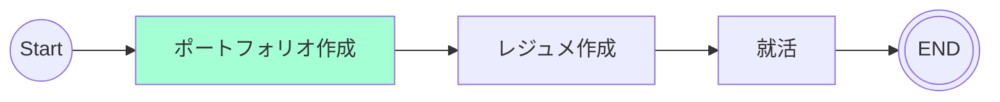

# 9/18(キックオフ)
## やったこと
Recursion運営との就活に関してのMTG

内容は下記に列記する。
* 自分のスキルセットの共有
  * Recursionの進捗(上級/OOP/デザインパターン/React/Project5/上級開発)修了
  * TypeScript
  * React
* 就職目標の共有
  * 冬までにフロントエンドエンジニアとして就職する
  * 就職条件はゆるめ（今後詰める）
* 就活に関してRecursion運営から提供できることの共有
  * レジュメ
  * スキル評価
  * 1on1でのMTG等
* これからすることの共有
  1. 一般向けのポートフォリオ作成(1カ月)
    * フレームワークを使用
    * WebAPIを使用
    * 正規表現を使用したバリデーション
    * OAuth2を使用
    * データベースを使用したもの（できればGraphQLを利用する）
  2. レジュメ作成
  3. 職探し

## 決定事項
* 引き継ぎ終了後、活動予定(9/20~)
* 1カ月で一般向けのポートフォリオ作成
* ポートフォリオ作成と並行して就活事情等をリサーチする

# 9/20 - 9/23
## 目的
Webアプリの全体像を把握する

## やったこと
- 記録用[リポジトリ](https://github.com/motsu8/recode_employment)作成
- [ロードマップ](#ロードマップ)作成
- [要件定義](https://github.com/motsu8/youtube_note/wiki/%E8%A6%81%E4%BB%B6%E5%AE%9A%E7%BE%A9)の設定
- [ワイヤフレーム](https://www.figma.com/file/4D9cXazTk4tETLAgHa1N0w/YouTube_Note?type=design&node-id=0%3A1&mode=design&t=szcxuvwjjXmHRGyn-1)作成
- [アクティビティ図](https://github.com/motsu8/youtube_note/wiki/%E8%A8%AD%E8%A8%88#%E3%82%A2%E3%82%AF%E3%83%86%E3%82%A3%E3%83%93%E3%83%86%E3%82%A3%E5%9B%B3)作成
- [クラス図](https://github.com/motsu8/youtube_note/wiki/%E8%A8%AD%E8%A8%88#%E3%82%AF%E3%83%A9%E3%82%B9%E5%9B%B3)作成
- Webアプリを開発する際の必要な調査
  - 外部APIの把握

## ロードマップ
アジャイル開発に則ってスケージュールを組む。
スプリントを1週間に設定して、1カ月後の10/18を最終期限とする(4週間)

| sprint |タスク|
|:---------:|:---:|
|sprint1(9/20 ~ 9/27)|要件定義・ワイヤフレーム・環境構築・技術スタック図・クラス図・アクティビティ図|
|sprint2(9/28 ~ 10/4)|開発|
|sprint3(10/5 ~ 10/11)|開発|
|sprint4(10/12 ~ 10/18)|調整・リリース|

### sprint1 タスク
- [x] 要件定義
- [x] ワイヤフレーム
- [ ] コンポーネントの把握
  - [参考](https://zenn.dev/overflow_offers/articles/20220523-component-design-best-practice)サイト
- [x] アクティビティ図
- [x] クラス図
  - [ ] YouTube Data APIクラス追加
- [ ] ER図
- [ ] 技術スタック
- [ ] 環境構築

## 調査項目
- [x] emailでの登録だとYouTubeプレイリストは使用できなさそう

YouTube Data APIでの認証では、APIキーでの認証とOAuth2での認証がある。
- APIキー認証
  - 公開されているデータを取得することができる
- OAuth2認証
  - ユーザーのYouTubeアカウントに関連付けされたデータを取得することができる

YouTube Dataを取得するクラスを検討する

- [ ] 要約で使用予定の生成AIの比較
- [ ] 技術スタック

## マイルストーン
ポートフォリオ作成中

# 9/24 - 10/1
## 目的
開発の技術選定、キャッチアップをし、開発をスムーズに行う

## やったこと
- [クラス図](https://github.com/motsu8/youtube_note/wiki/%E8%A8%AD%E8%A8%88#%E3%82%AF%E3%83%A9%E3%82%B9%E5%9B%B3)作成
- [ER図](https://github.com/motsu8/youtube_note/wiki/%E8%A8%AD%E8%A8%88#er%E5%9B%B3)作成
- [技術選定](https://github.com/motsu8/youtube_note/wiki/%E8%A8%AD%E8%A8%88#%E6%8A%80%E8%A1%93%E3%82%B9%E3%82%BF%E3%83%83%E3%82%AF)
- 開発環境構築
- 新しい技術のキャッチアップ
  - Supabase
  - Prisma
  - Next.js
  - Auth.js

## 検討事項
- [ ] 要約で使用予定の生成AIの比較
- [x] 技術スタック
  - [issue#1](https://github.com/motsu8/youtube_note/issues/1)参照
- [x] Auth機能の技術選定
  - [issue#1](https://github.com/motsu8/youtube_note/issues/1)からSupabase Authを使用して、自動生成されるAuthスキーマで認証周りをサクッと実装するつもりであったが、CRUD操作をPrismaでAPIを実装する際にSupabase AuthとPrismaの相性が悪いことが判明。
  - Prismaが複数のスキーマに対応していないことから認証機能はAuth.jsを使用して、SupabaseはDBとして利用することにした。
    - 具体的には[issue#6](https://github.com/motsu8/youtube_note/issues/6)を参照

## ロードマップ
アジャイル開発に則ってスケージュールを組む。
スプリントを1週間に設定して、1カ月後の10/18を最終期限とする(4週間)

| sprint |タスク|
|:---------:|:---:|
|sprint1(9/20 ~ 9/27)|要件定義・ワイヤフレーム・環境構築・技術スタック図・クラス図・アクティビティ図|
|sprint2(9/28 ~ 10/4)|開発|
|sprint3(10/5 ~ 10/11)|開発|
|sprint4(10/12 ~ 10/18)|調整・リリース|

### sprint1 タスク
- [x] 要件定義
- [x] ワイヤフレーム
- [ ] コンポーネントの把握
  - [参考](https://zenn.dev/overflow_offers/articles/20220523-component-design-best-practice)
- [x] アクティビティ図
- [x] クラス図
  - [x] YouTube Data APIクラス追加
- [x] ER図
- [ ] 技術スタック図
- [x] 環境構築

### sprint2 タスク
- [ ] キャッチアップ
  - [x] Next.js
  - [x] Supabase
  - [x] Prisma
  - [x] Auth.js
  - [ ] モックアップ
- [ ] API開発
- [ ] 画面開発

## マイルストーン
ポートフォリオ作成中

# 10/02 - 10/08
## 目的
ローカルで試作品を作成し、開発をスムーズに行う

## やったこと
- ローカルで試作品を作成
  - 認証機能
    - [ ] Auth.js
      - 認証画面に行くボタンを押すと、SNS選択ページを挟んでさらにSNS認証の画面となるのが自分的にマイナス
    - [x] Supabase Auth
      - SupabaseがUIを提供しているため、簡潔に済ませられる
      - Supabase Authを使用する場合、GUIでスキーマを決定しなければいけないため、Prismaを使用してのAPI開発はなくなる

  - データの操作
    - [x] Supabase
      - 上記 Supabase Authを使用するため、Supabaseが提供しているメソッドを使用する
    - [ ] Prisma
      - ORMを使用してみたかったが断念。

## 検討事項
- [ ] 要約で使用予定の生成AIの比較
- [x] Auth機能の技術選定
  - [issue#1](https://github.com/motsu8/youtube_note/issues/1)からSupabase Authを使用して、自動生成されるAuthスキーマで認証周りをサクッと実装するつもりであったが、CRUD操作をPrismaでAPIを実装する際にSupabase AuthとPrismaの相性が悪いことが判明。
  - ~~Prismaが複数のスキーマに対応していないことから認証機能はAuth.jsを使用して、SupabaseはDBとして利用することにした。~~
    - 具体的には[issue#6](https://github.com/motsu8/youtube_note/issues/6)を参照
  - Auth.jsでの実装だと、認証 → SNS選択 → SNS認証 となるためユーザー体験が悪い　→　Supabase Authを利用する

## ロードマップ
アジャイル開発に則ってスケージュールを組む。
スプリントを1週間に設定して、1カ月後の10/18を最終期限とする(4週間)

| sprint |タスク|
|:---------:|:---:|
|sprint1(9/20 ~ 9/27)|要件定義・ワイヤフレーム・環境構築・技術スタック図・クラス図・アクティビティ図|
|sprint2(9/28 ~ 10/4)|開発|
|sprint3(10/5 ~ 10/11)|開発|
|sprint4(10/12 ~ 10/18)|調整・リリース|

### sprint1 タスク
- [x] 要件定義
- [x] ワイヤフレーム
- [ ] コンポーネントの把握
  - [参考](https://zenn.dev/overflow_offers/articles/20220523-component-design-best-practice)
- [x] アクティビティ図
- [x] クラス図
  - [x] YouTube Data APIクラス追加
- [x] ER図
- [ ] 技術スタック図
- [x] 環境構築

### sprint2 タスク
- [ ] キャッチアップ
  - [x] Next.js
  - [x] Supabase
  - [x] Prisma
  - [x] Auth.js
  - [ ] モックアップ
- [ ] API開発
- [ ] 画面開発

## マイルストーン
ポートフォリオ作成中

# 10/09 - 10/15
## 目的
画面開発を行う。

## やったこと
- 画面開発
  - LP画面
  - Home画面
- Google OAuthを使用してのサインイン・サインアウト
  - セッション情報の有無でページ遷移
- 使用するライブラリの検討
  - YouTube
    - YouTube Data API (OAuthユーザーのプレイリストを読み込む)
    - react-youtube (動画idを渡せば、動画を埋め込むことができる)
  - MarkDown
    - react-markdown (マークダウンテキストをReactコンポーネントに変換)
    - remark-gfm (GitHubでのマークダウンを適用)

## 検討事項
- [ ] 要約で使用予定の生成AIの比較

## ロードマップ
アジャイル開発に則ってスケージュールを組む。
スプリントを1週間に設定して、~~1カ月後の10/18を最終期限とする(4週間)~~
1カ月後の10/25を最終期限とする(5週間)

| sprint |タスク|
|:---------:|:---:|
|sprint1(9/20 ~ 9/27)|要件定義・ワイヤフレーム・環境構築・技術スタック図・クラス図・アクティビティ図|
|sprint2(9/28 ~ 10/4)|開発|
|sprint3(10/5 ~ 10/11)|開発|
|sprint4(10/12 ~ 10/18)|開発|
|sprint5(10/19 ~ 10/25)|調整・リリース|

### sprint1 タスク
- [ ] コンポーネントの把握
  - [参考](https://zenn.dev/overflow_offers/articles/20220523-component-design-best-practice)
- [ ] 技術スタック図

### sprint3 タスク
- [ ] API開発
- [ ] 画面開発
  - [x] LP画面
  - [x] Home画面
  - [ ] ノート画面
  - [ ] 動画視聴画面

### sprint4 タスク
- [ ] API開発
- [ ] 画面開発
  - [x] LP画面
  - [x] Home画面
  - [ ] ノート画面
  - [ ] 動画視聴画面

## マイルストーン
ポートフォリオ作成中

