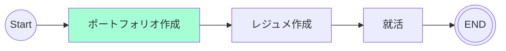

# 9/24 - 10/1
## 目的
開発の技術選定、キャッチアップをし、開発をスムーズに行う

## やったこと
- [クラス図](https://github.com/motsu8/youtube_note/wiki/%E8%A8%AD%E8%A8%88#%E3%82%AF%E3%83%A9%E3%82%B9%E5%9B%B3)作成
- [ER図](https://github.com/motsu8/youtube_note/wiki/%E8%A8%AD%E8%A8%88#er%E5%9B%B3)作成
- [技術選定](https://github.com/motsu8/youtube_note/wiki/%E8%A8%AD%E8%A8%88#%E6%8A%80%E8%A1%93%E3%82%B9%E3%82%BF%E3%83%83%E3%82%AF)
- 開発環境構築
- 新しい技術のキャッチアップ
  - Supabase
  - Prisma
  - Next.js
  - Auth.js

## 検討事項
- [ ] 要約で使用予定の生成AIの比較
- [x] 技術スタック
  - [issue](https://github.com/motsu8/youtube_note/issues/1)参照

## ロードマップ
アジャイル開発に則ってスケージュールを組む。
スプリントを1週間に設定して、1カ月後の10/18を最終期限とする(4週間)

| sprint |タスク|
|:---------:|:---:|
|sprint1(9/20 ~ 9/27)|要件定義・ワイヤフレーム・環境構築・技術スタック図・クラス図・アクティビティ図|
|sprint2(9/28 ~ 10/4)|開発|
|sprint3(10/5 ~ 10/11)|開発|
|sprint4(10/12 ~ 10/18)|調整・リリース|

### sprint1 タスク
- [x] 要件定義
- [x] ワイヤフレーム
- [ ] コンポーネントの把握
  - [参考](https://zenn.dev/overflow_offers/articles/20220523-component-design-best-practice)
- [x] アクティビティ図
- [x] クラス図
  - [x] YouTube Data APIクラス追加
- [x] ER図
- [ ] 技術スタック図
- [x] 環境構築

### sprint2 タスク
- [ ] キャッチアップ
  - [x] Next.js
  - [x] Supabase
  - [x] Prisma
  - [x] Auth.js
  - [ ] モックアップ
- [ ] API開発
- [ ] 画面開発

## マイルストーン
ポートフォリオ作成中

