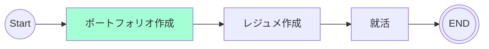

# 9/24 - 10/1
## 目的
ローカルで試作品を作成し、開発をスムーズに行う

## やったこと
- ローカルで試作品を作成
  - 認証機能
    - [ ] Auth.js
      - 認証画面に行くボタンを押すと、SNS選択ページを挟んでさらにSNS認証の画面となるのが自分的にマイナス
    - [x] Supabase Auth
      - SupabaseがUIを提供しているため、簡潔に済ませられる
      - Supabase Authを使用する場合、GUIでスキーマを決定しなければいけないため、Prismaを使用してのAPI開発はなくなる

  - データの操作
    - [x] Supabase
      - 上記 Supabase Authを使用するため、Supabaseが提供しているメソッドを使用する
    - [ ] Prisma
      - ORMを使用してみたかったが断念。

## 検討事項
- [ ] 要約で使用予定の生成AIの比較
- [x] Auth機能の技術選定
  - [issue#1](https://github.com/motsu8/youtube_note/issues/1)からSupabase Authを使用して、自動生成されるAuthスキーマで認証周りをサクッと実装するつもりであったが、CRUD操作をPrismaでAPIを実装する際にSupabase AuthとPrismaの相性が悪いことが判明。
  - ~~Prismaが複数のスキーマに対応していないことから認証機能はAuth.jsを使用して、SupabaseはDBとして利用することにした。~~
    - 具体的には[issue#6](https://github.com/motsu8/youtube_note/issues/6)を参照
  - Auth.jsでの実装だと、認証 → SNS選択 → SNS認証 となるためユーザー体験が悪い　→　Supabase Authを利用する

## ロードマップ
アジャイル開発に則ってスケージュールを組む。
スプリントを1週間に設定して、1カ月後の10/18を最終期限とする(4週間)

| sprint |タスク|
|:---------:|:---:|
|sprint1(9/20 ~ 9/27)|要件定義・ワイヤフレーム・環境構築・技術スタック図・クラス図・アクティビティ図|
|sprint2(9/28 ~ 10/4)|開発|
|sprint3(10/5 ~ 10/11)|開発|
|sprint4(10/12 ~ 10/18)|調整・リリース|

### sprint1 タスク
- [x] 要件定義
- [x] ワイヤフレーム
- [ ] コンポーネントの把握
  - [参考](https://zenn.dev/overflow_offers/articles/20220523-component-design-best-practice)
- [x] アクティビティ図
- [x] クラス図
  - [x] YouTube Data APIクラス追加
- [x] ER図
- [ ] 技術スタック図
- [x] 環境構築

### sprint2 タスク
- [ ] キャッチアップ
  - [x] Next.js
  - [x] Supabase
  - [x] Prisma
  - [x] Auth.js
  - [ ] モックアップ
- [ ] API開発
- [ ] 画面開発

## マイルストーン
ポートフォリオ作成中

