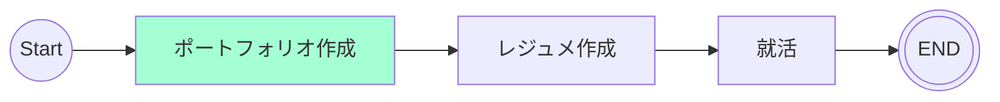

# 10/09 - 10/15
## 目的
最低限の画面開発を行う。

## やったこと
- 画面開発
  - LP画面
  - Home画面
- Google OAuthを使用してのサインイン・サインアウト
  - セッション情報の有無でページ遷移
- 使用するライブラリの検討
  - YouTube
    - YouTube Data API (OAuthユーザーのプレイリストを読み込む)
    - react-youtube (動画idを渡せば、動画を埋め込むことができる)
  - MarkDown
    - react-markdown (マークダウンテキストをReactコンポーネントに変換)
    - remark-gfm (GitHubでのマークダウンを適用)

## 検討事項
- [ ] 要約で使用予定の生成AIの比較

## ロードマップ
アジャイル開発に則ってスケージュールを組む。
スプリントを1週間に設定して、~~1カ月後の10/18を最終期限とする(4週間)~~
1カ月後の10/25を最終期限とする(5週間)

| sprint |タスク|
|:---------:|:---:|
|sprint1(9/20 ~ 9/27)|要件定義・ワイヤフレーム・環境構築・技術スタック図・クラス図・アクティビティ図|
|sprint2(9/28 ~ 10/4)|開発|
|sprint3(10/5 ~ 10/11)|開発|
|sprint4(10/12 ~ 10/18)|開発|
|sprint5(10/19 ~ 10/25)|調整・リリース|

### sprint1 タスク
- [ ] コンポーネントの把握
  - [参考](https://zenn.dev/overflow_offers/articles/20220523-component-design-best-practice)
- [ ] 技術スタック図

### sprint3 タスク
- [ ] API開発
- [ ] 画面開発
  - [x] LP画面
  - [x] Home画面
  - [ ] ノート画面
  - [ ] 動画視聴画面

### sprint4 タスク
- [ ] API開発
- [ ] 画面開発
  - [x] LP画面
  - [x] Home画面
  - [ ] ノート画面
  - [ ] 動画視聴画面

## マイルストーン
ポートフォリオ作成中

