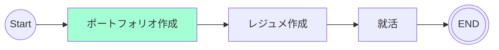

# 10/16 - 10/22
## 目的
最低限の画面開発を行う。

## 関連リンク
[GitHub リポジトリ](https://github.com/motsu8/youtube_note)
[デプロイ先](https://youtube-note-neon.vercel.app/)

## やったこと
- 画面開発
  - Note画面開発
  - 表示データ（フォルダ・ファイル）の再帰的処理でのパンくずリスト
- API開発
  - Home画面でのYouTube動画検索API
  - 表示データのCRUD操作のAPI開発

## 検討事項
- [ ] 要約で使用予定の生成AIの比較

## ロードマップ
アジャイル開発に則ってスケージュールを組む。
スプリントを1週間に設定して、~~1カ月後の10/18を最終期限とする(4週間)~~

1カ月後の10/25を最終期限とする(5週間)

| sprint |タスク|
|:---------:|:---:|
|sprint1(9/20 ~ 9/27)|要件定義・ワイヤフレーム・環境構築・技術スタック図・クラス図・アクティビティ図|
|sprint2(9/28 ~ 10/4)|開発|
|sprint3(10/5 ~ 10/11)|開発|
|sprint4(10/12 ~ 10/18)|開発|
|sprint5(10/19 ~ 10/25)|調整・リリース|

### sprint1 タスク
- [ ] コンポーネントの把握
  - [参考](https://zenn.dev/overflow_offers/articles/20220523-component-design-best-practice)
- [ ] 技術スタック図

### sprint3 タスク
### sprint4 タスク
### sprint5 タスク
- [ ] API開発
- [ ] 画面開発
  - [x] LP画面
  - [x] Home画面
  - [x] サイドバー
    - [ ] Homeボタン追加
    - [ ] session情報でのLP画面の遷移
  - [x] ノート画面
    - [ ] MarkDownエディタ使用
      - [ ] react-markdown (マークダウンテキストをReactコンポーネントに変換)
      - [ ] remark-gfm (GitHubでのマークダウンを適用)
  - [ ] 動画視聴画面
    - [ ] Supabase Authのprovider_tokenを使用してYouTube Data APIを使用できるか
      - [ ] YouTube Data API (OAuthユーザーのプレイリストを読み込む)

## マイルストーン
ポートフォリオ作成中

