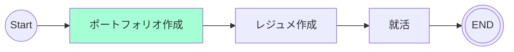

# 10/23 - 10/29
## 目的
Webサービスとして利用できるような開発を行う。

## 関連リンク
[GitHub リポジトリ](https://github.com/motsu8/youtube_note)

[デプロイ先](https://youtube-note-neon.vercel.app/)

## やったこと
- 画面開発
  - ユーザー画面
  - ホーム画面
- 認証
  - emailでのサインアップ/ログイン実装
- コンポーネント開発
  - MarkDownエディタ
  - HTMLプレビュー

## 検討事項
- [ ] 自動字幕の取得方法
- [ ] 要約で使用予定の生成AIの比較

## ロードマップ
アジャイル開発に則ってスケージュールを組む。

スプリントを1週間に設定して、~~1カ月後の10/18を最終期限とする(4週間)~~

10/25を最終期限とする(5週間)

| sprint |タスク|
|:---------:|:---:|
|sprint1(9/20 ~ 9/27)|要件定義・ワイヤフレーム・環境構築・技術スタック図・クラス図・アクティビティ図|
|sprint2(9/28 ~ 10/4)|開発|
|sprint3(10/5 ~ 10/11)|開発|
|sprint4(10/12 ~ 10/18)|開発|
|sprint5(10/19 ~ 10/25)|調整・リリース|

### sprint5 タスク
- [x] API開発
- [x] 画面開発
  - [x] LP画面
  - [x] Home画面
  - [x] サイドバー
    - [x] Homeボタン追加
    - [x] session情報でのLP画面の遷移
  - [x] ノート画面
    - [x] MarkDownエディタ使用
      - [x] react-markdown (マークダウンテキストをReactコンポーネントに変換)
      - [x] remark-gfm (GitHubでのマークダウンを適用)
  - [x] 動画視聴画面

### 残りタスク
- [ ] コンポーネントの把握
  - [参考](https://zenn.dev/overflow_offers/articles/20220523-component-design-best-practice)
- [ ] 技術スタック図
- [ ] 画面開発
  - [ ] ホーム画面の充実
  - [ ] UIのブラッシュアップ
- [ ] 機能開発
  - [ ] emailでのサインアップ/ログイン
  - [ ] 認証周りのバリデーション機能
- [ ] その他
  - [ ] READEME

## マイルストーン
ポートフォリオ作成中

