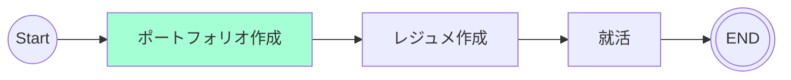

# 10/30 - 11/05
## 目的
Webサービスとして利用できるような開発を行う。

## 関連リンク
[GitHub リポジトリ](https://github.com/motsu8/youtube_note)

[デプロイ先](https://youtube-note-neon.vercel.app/)

## やったこと
- 画面開発
  - ホーム画面実装
  - 最近追加した動画の表示実装
- 認証
  - 入力情報の正規表現を用いたバリデーション機能
- 生成AIの要約機能の検討
  - YouTubeの自動字幕トラック取得はバックエンドで行う
    - JSでのサポートはなさそう
    - Pythonのライブラリを使用して取得することになりそう
  - OpenAI APIによって要約を生成してもらう

## 検討事項
- [ ] 自動字幕の取得方法
- [x] 要約で使用予定の生成AIの比較
  - OpenAI API

## ロードマップ
アジャイル開発に則ってスケージュールを組む。

スプリントを1週間に設定して、~~1カ月後の10/18を最終期限とする(4週間)~~

1カ月後の10/25を最終期限とする(5週間)

| sprint |タスク|
|:---------:|:---:|
|sprint1(9/20 ~ 9/27)|要件定義・ワイヤフレーム・環境構築・技術スタック図・クラス図・アクティビティ図|
|sprint2(9/28 ~ 10/4)|開発|
|sprint3(10/5 ~ 10/11)|開発|
|sprint4(10/12 ~ 10/18)|開発|
|sprint5(10/19 ~ 10/25)|調整・リリース|

### 残りタスク
- [ ] コンポーネントの把握
  - [参考](https://zenn.dev/overflow_offers/articles/20220523-component-design-best-practice)
- [ ] 技術スタック図
- [ ] 画面開発
  - [x] ホーム画面の充実
  - [ ] UIのブラッシュアップ
- [ ] 機能開発
  - [x] emailでのサインアップ/ログイン
  - [x] 認証周りのバリデーション機能
  - [ ] 生成AIによる要約機能
- [ ] その他
  - [ ] READEME

## マイルストーン
ポートフォリオ開発終了。

残りタスクを行いながら、レジュメ作成に移行する。

