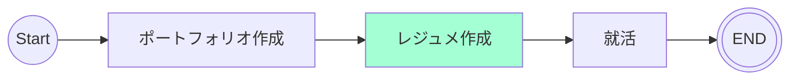

# 11/13 - 11/19
## 目的
ポートフォリオの改善を行いながらレジュメ作成

## 関連リンク
[ポートフォリオ リポジトリ](https://github.com/motsu8/youtube_note)

[デプロイ先](https://youtube-note-neon.vercel.app/)

## やったこと
- ポートフォリオ
  - lighthouse score改善
- レジュメ
  - 履歴書の添削修正
  - 職務経歴書の添削修正

### 残りタスク
- [ ] コンポーネントの把握
  - [参考](https://zenn.dev/overflow_offers/articles/20220523-component-design-best-practice)
- [ ] 技術スタック図
- [ ] 画面開発
  - [ ] ダークモード
  - [x] lighthouse score改善
- [ ] 機能開発
  - [ ] playList機能
  - [ ] YouTube動画の自動字幕トラックの取得
  - [ ] 生成AIによる要約機能
- [ ] その他
  - [ ] READEME

## ロードマップ
| sprint |タスク|
|:---------:|:---:|
|sprint1(11/13 ~ 11/19)|レジュメ作成・添削依頼・ポートフォリオブラッシュアップ|
|sprint2(11/20 ~ )| レジュメ・職探し・ポートフォリオブラッシュアップ |

## マイルストーン
ポートフォリオ開発終了。

残りタスクを行いながら、レジュメ作成に移行する。

